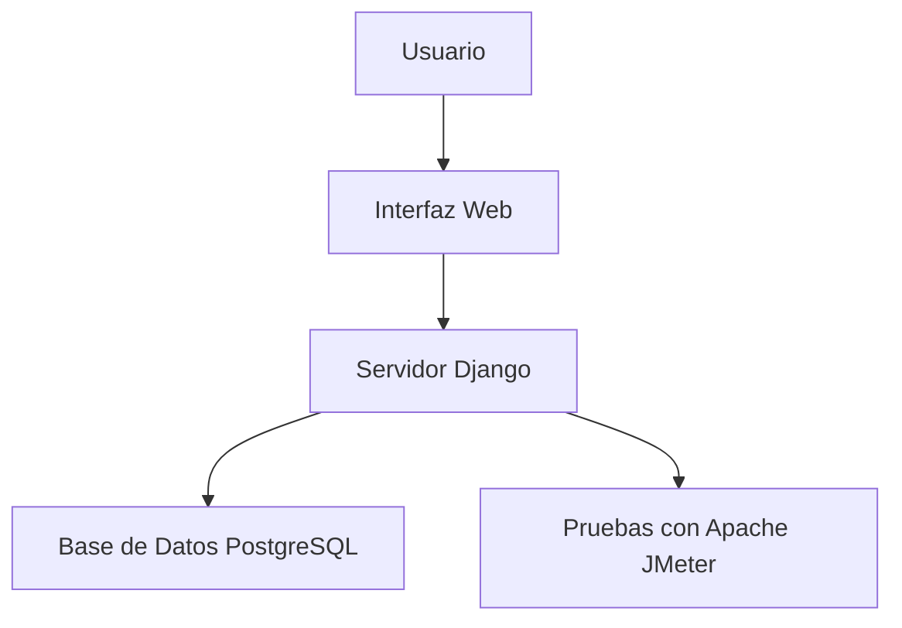
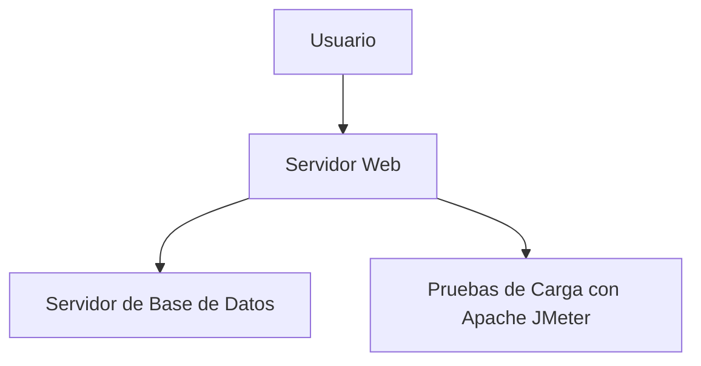

# Proyecto Logs App

## Descripción del Proyecto

Este proyecto está diseñado para gestionar y visualizar logs generados en un sistema sobrecargado, asegurando un rendimiento aceptable. Se han implementado pruebas de carga utilizando Apache JMeter, con una base de datos PostgreSQL, y la aplicación se ejecuta sobre Django.

### Arquitectura del Proyecto

El sistema sigue una arquitectura basada en el patrón MVC (Modelo-Vista-Controlador) proporcionado por Django, con una base de datos relacional en PostgreSQL para almacenar los logs.

## ASR (Arquitectura de Soluciones Requerida)

**Historia de Usuario:**

Como administrador de Ofipensiones, cuando gestiono y reviso los logs a través del manejador de logs, dado que el sistema se encuentra en un ambiente sobrecargado, quiero que se mantenga un rendimiento aceptable sin caídas ni lentitud significativa. El tiempo de respuesta para la consulta y recuperación de datos no debe superar los 30 segundos en el 95% de los casos.

**Criterios de Éxito:**

1. El sistema debe ser capaz de gestionar grandes volúmenes de datos (mínimo 10,000 registros de logs) sin sobrepasar los 30 segundos en tiempos de consulta y carga.
2. El sistema debe permitir la visualización de los logs a través de una interfaz web eficiente.
3. Deben realizarse pruebas de rendimiento usando Apache JMeter para validar la escalabilidad del sistema.

## Diagramas de Arquitectura

### Diagrama de Componentes




### Diagrama de Despliegue



## Tácticas de Arquitectura

Para asegurar el rendimiento y la disponibilidad del sistema, se han implementado las siguientes tácticas de arquitectura:

1. **Tácticas de Rendimiento**:

   - **Almacenamiento de logs en lote**: Los logs se guardan en grandes cantidades en la base de datos para reducir la carga de múltiples transacciones pequeñas.
   - **Uso de índices en PostgreSQL**: Se han creado índices en campos clave de las tablas de logs para mejorar los tiempos de consulta.
2. **Tácticas de Disponibilidad**:

   - **Implementación de un servidor dedicado para la base de datos**: El servidor de la base de datos está separado del servidor de la aplicación para evitar sobrecargas.
   - **Monitoreo y alertas**: Implementación de monitoreo del rendimiento y generación de alertas para mantener la disponibilidad del sistema.

## Tecnologías Utilizadas

- **Django**: Framework web para la construcción de la aplicación backend.
- **PostgreSQL**: Base de datos relacional donde se almacenan los logs.
- **Apache JMeter**: Herramienta utilizada para realizar pruebas de carga sobre el sistema.
- **HTML/CSS**: Para la construcción del frontend que muestra los logs.
- **Python**: Lenguaje utilizado para desarrollar la aplicación.

## Descripción del Experimento

Se realizarán pruebas de carga utilizando Apache JMeter para simular un escenario donde la base de datos contiene más de 10,000 registros de logs. El objetivo es validar que el tiempo de respuesta para las consultas y la recuperación de datos no supere los 30 segundos en el 95% de los casos, incluso en condiciones de sobrecarga.

### Pasos del Experimento:

1. **Generación de Datos**: Se crearán más de 10,000 registros aleatorios de logs en la base de datos.
2. **Pruebas de Rendimiento**: Se usarán scripts de Apache JMeter para simular múltiples usuarios accediendo a la aplicación al mismo tiempo.
3. **Monitoreo del Sistema**: Se controlarán los tiempos de respuesta y el uso de recursos del servidor durante las pruebas.

## Resultados Esperados

1. **Rendimiento del Sistema**: Se espera que el sistema mantenga un tiempo de respuesta inferior a 30 segundos para el 95% de las consultas realizadas, incluso en condiciones de sobrecarga.
2. **Escalabilidad**: El sistema debe poder manejar la generación y consulta de grandes volúmenes de logs sin una degradación significativa en el rendimiento.
3. **Disponibilidad**: El sistema debe permanecer disponible y operativo durante las pruebas de carga.

## Instrucciones de Configuración y Ejecución

1. **Clonar el repositorio**:

   ```bash
   git clone https://github.com/Diplomatictw0/repo-logs.git
   cd repo-logs
   ```
2. **Crear el entorno virtual**:

   ```bash
   python3 -m venv myenv
   source myenv/bin/activate
   ```
3. **Instalar las dependencias**:

   ```bash
   pip install -r requirements.txt
   ```
4. **Realizar las migraciones**:

   ```bash
   python manage.py migrate
   ```
5. **Cargar los datos iniciales**:

   Se generarán datos automáticamente al ejecutar el proyecto.
6. **Iniciar el servidor**:

   ```bash
   python manage.py runserver 8080
   ```
7. **Realizar pruebas de carga** (opcional):

   Utiliza Apache JMeter para simular múltiples usuarios accediendo al sistema.

---

## Contribuciones

Siente libre de realizar contribuciones a este proyecto. Las solicitudes de extracción son bienvenidas.

## Licencia

Este proyecto está bajo la licencia MIT - consulta el archivo LICENSE para más detalles.

```

```
