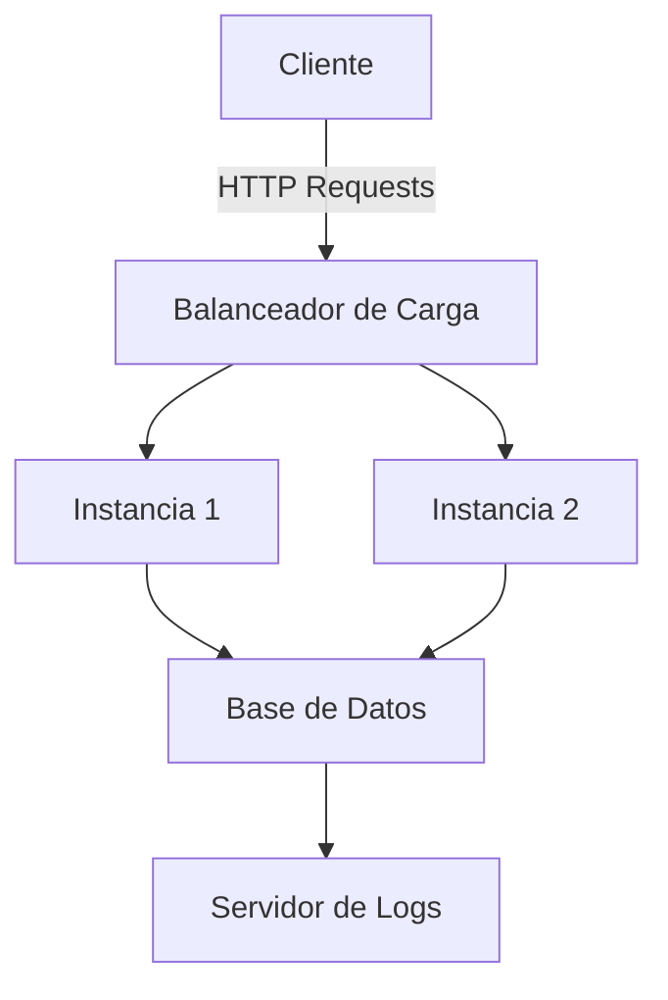
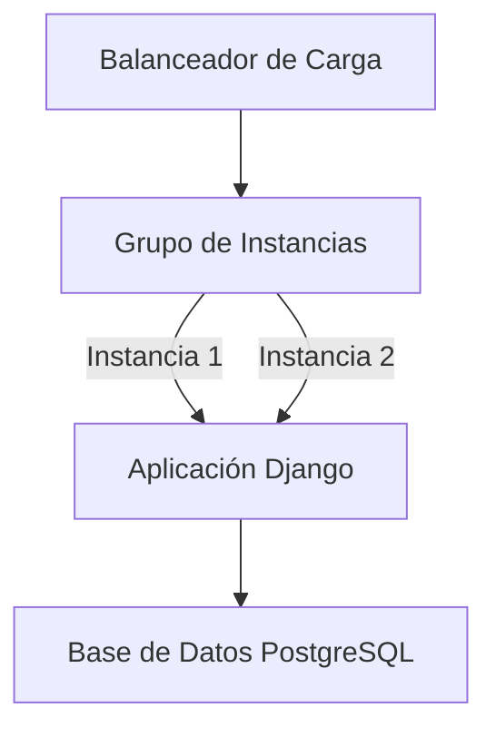

# Repo-Logs

Este repositorio contiene el código y la documentación de un sistema para la gestión y revisión de logs en un entorno sobrecargado, garantizando tiempos de respuesta aceptables bajo altas demandas. El objetivo del proyecto es asegurar que las consultas de logs sean rápidas y eficientes, incluso cuando se maneja una gran cantidad de registros.

## ASR Trabajado

El ASR (Requerimiento de Atributo de Calidad) en este proyecto se enfoca en **escalabilidad y rendimiento**, considerando el manejo eficiente de logs bajo alta carga:

**Latencia y Escalabilidad:**

- _"Como administrador de Ofipensiones, cuando gestiono y reviso los logs a través del manejador de logs, dado que el sistema se encuentra en un ambiente sobrecargado, yo quiero que se mantenga un rendimiento aceptable sin caídas ni lentitud significativa, y debe suceder que el tiempo de respuesta para la consulta y la recuperación de datos no supere los 30 segundos en el 95% de los casos."_

Este requerimiento implica que el sistema debe poder manejar consultas a gran escala y responder de manera eficiente, incluso cuando hay miles de registros en la base de datos.

## Características del Proyecto

1. **Gestión y almacenamiento de logs**: El sistema está diseñado para manejar grandes volúmenes de datos, con al menos 10,000 registros de logs simulados.
2. **Visualización de logs**: Los logs se pueden visualizar y consultar a través de una interfaz web, garantizando tiempos de respuesta rápidos.
3. **Balanceador de carga con GCC**: El balanceador de carga distribuido asegura que las solicitudes sean manejadas eficientemente por múltiples instancias.
4. **Pruebas de carga con JMeter**: Se utiliza JMeter para probar la carga en el sistema y verificar la escalabilidad.
5. **Simulación con GCC**: GCC se emplea para simular el comportamiento de la aplicación en un entorno con balanceador de carga.
6. **PostgreSQL como base de datos**: Almacenamiento eficiente y rápido de logs mediante el uso de PostgreSQL.
7. **Django como framework web**: La aplicación web se ha desarrollado con Django, facilitando la gestión de la interfaz y las consultas.
8. **Consulta de 10,000 registros en menos de 30 segundos**: El sistema está optimizado para cargar 10,000 registros en menos de 30 segundos en el 95% de los casos.

## Tácticas Utilizadas

1. **Escalabilidad Horizontal:** La aplicación está diseñada para agregar más instancias bajo demanda, permitiendo que el sistema maneje un mayor volumen de solicitudes.
2. **Balanceo de Carga:** Utilizamos un balanceador de carga para distribuir el tráfico entre varias instancias, mejorando la disponibilidad y la fiabilidad.
3. **Caché de Consultas:** Implementación de técnicas de caché para reducir los tiempos de respuesta en las consultas más frecuentes.

## Estilos Utilizados

- **MVC (Modelo-Vista-Controlador)**: Se ha seguido el patrón MVC en la arquitectura de la aplicación, donde:

  - **Modelo**: Define la estructura de los datos (logs).
  - **Vista**: Presenta la información a los usuarios (HTML y CSS).
  - **Controlador**: Maneja la lógica y las interacciones (Django views).
- El proyecto utiliza un enfoque de diseño simple y efectivo para la interfaz de usuario. El archivo `styles.css` en la carpeta `static/` proporciona estilos básicos para la aplicación, garantizando que sea visualmente accesible y fácil de usar.

## Diagramas

### Diagrama de Componentes



### Diagrama de Despliegue



## Tecnología

- **Django:** Framework web para el desarrollo de la aplicación.
- **PostgreSQL:** Sistema de gestión de bases de datos utilizado para almacenar logs.
- **Google Cloud Platform (GCP):** Infraestructura en la nube utilizada para implementar y escalar la aplicación.
- **Mermaid:** Herramienta para generar diagramas en Markdown, utilizada para representar visualmente la arquitectura del sistema.

## Instalación y Despliegue

1. Clona el repositorio:

   ```bash
   git clone https://github.com/Diplomatictw0/repo-logs.git
   cd repo-logs
   ```
2. Ejecuta los scripts de configuración en la carpeta `scripts/` para desplegar la aplicación y configurar el balanceador de carga.
3. Accede a la aplicación a través de la dirección IP del balanceador de carga.

## Contribuciones

Las contribuciones son bienvenidas. Si deseas mejorar el proyecto o corregir errores, abre un issue o un pull request.

## Licencia

Este proyecto está bajo la Licencia MIT. Consulta el archivo LICENSE para más detalles.
