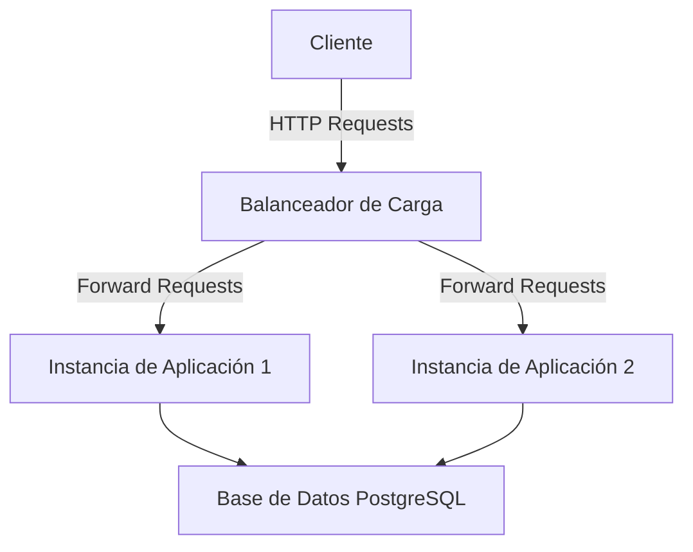
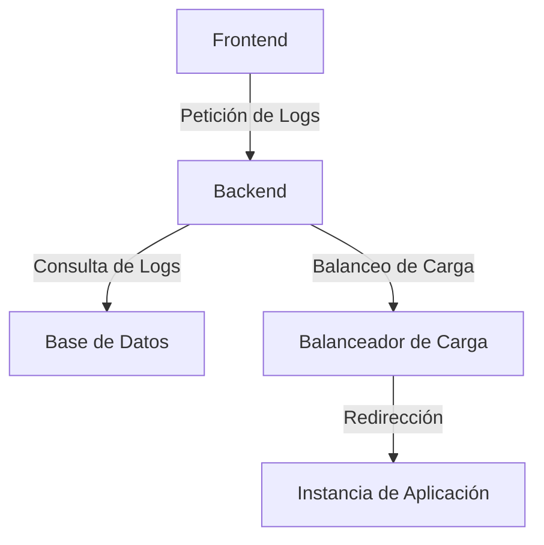

# Repo-Logs

Este repositorio contiene el código y la documentación de un sistema para la gestión y revisión de logs en un entorno sobrecargado, garantizando tiempos de respuesta aceptables bajo altas demandas. El objetivo del proyecto es asegurar que las consultas de logs sean rápidas y eficientes, incluso cuando se maneja una gran cantidad de registros.

## ASR Trabajado

El ASR (Requerimiento de Atributo de Calidad) en este proyecto se enfoca en **escalabilidad y rendimiento**, considerando el manejo eficiente de logs bajo alta carga:

**Latencia y Escalabilidad:**

- _"Como administrador de Ofipensiones, cuando gestiono y reviso los logs a través del manejador de logs, dado que el sistema se encuentra en un ambiente sobrecargado, yo quiero que se mantenga un rendimiento aceptable sin caídas ni lentitud significativa, y debe suceder que el tiempo de respuesta para la consulta y la recuperación de datos no supere los 30 segundos en el 95% de los casos."_

Este requerimiento implica que el sistema debe poder manejar consultas a gran escala y responder de manera eficiente, incluso cuando hay miles de registros en la base de datos.

## Características del Proyecto

1. **Gestión y almacenamiento de logs**: El sistema está diseñado para manejar grandes volúmenes de datos, con al menos 10,000 registros de logs simulados.
2. **Visualización de logs**: Los logs se pueden visualizar y consultar a través de una interfaz web, garantizando tiempos de respuesta rápidos.
3. **Balanceador de carga con GCC**: El balanceador de carga distribuido asegura que las solicitudes sean manejadas eficientemente por múltiples instancias.
4. **Pruebas de carga con JMeter**: Se utiliza JMeter para probar la carga en el sistema y verificar la escalabilidad.
5. **Simulación con GCC**: GCC se emplea para simular el comportamiento de la aplicación en un entorno con balanceador de carga.
6. **PostgreSQL como base de datos**: Almacenamiento eficiente y rápido de logs mediante el uso de PostgreSQL.
7. **Django como framework web**: La aplicación web se ha desarrollado con Django, facilitando la gestión de la interfaz y las consultas.
8. **Consulta de 10,000 registros en menos de 30 segundos**: El sistema está optimizado para cargar 10,000 registros en menos de 30 segundos en el 95% de los casos.

## Tácticas Utilizadas

- **Caché**: Implementar caché en consultas frecuentes para reducir la carga en la base de datos y mejorar los tiempos de respuesta.
- **Sharding**: Distribuir los registros de logs en diferentes bases de datos según algún criterio, permitiendo un acceso más rápido.
- **Balanceo de carga**: Usar un balanceador de carga para repartir las solicitudes entre varias instancias de la aplicación, optimizando el rendimiento.
- **Optimización de consultas**: Usar índices en las columnas más consultadas para acelerar el acceso a los datos.

## Diagramas

### Diagrama de Despliegue



### Diagrama de Componentes



## Estilos Utilizados

- **MVC (Modelo-Vista-Controlador)**: Se ha seguido el patrón MVC en la arquitectura de la aplicación, donde:

  - **Modelo**: Define la estructura de los datos (logs).
  - **Vista**: Presenta la información a los usuarios (HTML y CSS).
  - **Controlador**: Maneja la lógica y las interacciones (Django views).
- **RESTful API**: Se utiliza un enfoque REST para la comunicación entre el frontend y el backend, permitiendo interacciones simples y eficientes.
- **Microservicios**: El uso de microservicios permite que diferentes componentes de la aplicación puedan escalar independientemente, mejorando la resiliencia y escalabilidad del sistema.

## Tecnologías Usadas

### 1. **Django**

- **Descripción**: Framework web utilizado para el desarrollo de la aplicación. Se encarga de gestionar la lógica de negocio y la interfaz de usuario.
- **Ubicación en el código**:
  - `urls.py`: Maneja las rutas de la aplicación.
  - `views.py`: Controla la lógica de la presentación de logs.
  - `models.py`: Define la estructura de los datos de logs.

```python
# Ejemplo en urls.py
from django.urls import path
from . import views

urlpatterns = [
    path('logs/', views.logs_view, name='logs_view'),
]
```

### 2. **PostgreSQL**

- **Descripción**: Base de datos relacional que almacena los logs y permite realizar consultas eficientes.
- **Ubicación en el código**:
  - `settings.py`: Configuración de la conexión a PostgreSQL.

```python
# Ejemplo en settings.py
DATABASES = {
    'default': {
        'ENGINE': 'django.db.backends.postgresql',
        'NAME': 'log_db',
        'USER': 'admin',
        'PASSWORD': 'password',
        'HOST': 'localhost',
        'PORT': '5432',
    }
}
```

### 3. **Apache JMeter**

- **Descripción**: Herramienta utilizada para simular múltiples usuarios realizando consultas de logs y medir el tiempo de respuesta.
- **Uso**: Archivo `.jmx` configurado para pruebas de carga y simulación de múltiples usuarios accediendo simultáneamente.

```bash
# Ejecución de pruebas con JMeter
jmeter -n -t tests/load_test.jmx -l results/logs_test_results.jtl
```

### 4. **GCC (Google Cloud Components)**

- **Descripción**: Se utiliza para el despliegue y simulación de balanceo de carga en un entorno escalable.
- **Uso**: Configuración del balanceador de carga en `gcc-config.yaml` y despliegue con scripts de shell.

```bash
# Despliegue del balanceador de carga con GCC
bash scripts/load_balancer.sh
```

### 5. **Balanceador de carga con GCC**

- **Descripción**: El balanceador de carga distribuido asegura que las solicitudes entrantes se reparten entre varios nodos para optimizar el rendimiento.
- **Ubicación en el código**:
  - Implementación en `scripts/load_balancer.sh`.

```bash
# Despliegue y configuración del balanceador de carga
gcloud compute forwarding-rules create $FORWARDING_RULE_NAME --target-pool=$TARGET_POOL_NAME --region=$REGION --ports=8080
```

## Estructura del Proyecto

```

repo-logs/
├── django_app/
│   ├── logs_project/
│   │   ├── __init__.py
│   │   ├── settings.py
│   │   ├── urls.py
│   │   └── wsgi.py
│   ├── logs_app/
│   │   ├── __init__.py
│   │   ├── admin.py
│   │   ├── apps.py
│   │   ├── migrations/
│   │   │   └── __init__.py
│   │   ├── models.py
│   │   ├── tests.py
│   │   ├── views.py
│   │   └── urls.py
│   ├── manage.py
│   └── static/
│       └── styles.css
├── scripts/
│   ├── deploy.sh         # Script para el despliegue y configuración de GCC
│   ├── load_balancer.sh  # Configuración del balanceador de carga
│   └── database_setup.sh # Script de inicialización de PostgreSQL y carga de datos
├── csv/
│   └── logs.csv          # Archivo CSV con 10,000 registros de logs
├── gcc_setup/
│   ├── gcc-config.yaml    # Configuración de GCC para simulación
│   └── readme.md          # Guía específica para la configuración de GCC
└── requeriments.txt
└── README.md              # Documentación del proyecto
```

## Instalación y Configuración

1. **Clonar el repositorio**:

```bash
git clone https://github.com/tuusuario/repo-logs.git
cd repo-logs
```

2. **Instalar las dependencias**:

```bash
pip install -r requirements.txt
```

3. **Configurar PostgreSQL**:

```bash
psql -U postgres
CREATE DATABASE log_db;
```

4. **Aplicar migraciones de Django**:

```bash
python manage.py migrate


```

5. **Desplegar el balanceador de carga con GCC**:

```bash
bash scripts/deploy.sh
```

¡El sistema está listo para ser utilizado!

```

---

Este README proporciona una visión integral del proyecto, detallando los ASR, tácticas, tecnologías, y diagramas necesarios para entender la arquitectura y el funcionamiento del sistema. Si necesitas más información o ajustes adicionales, no dudes en decírmelo.
```
